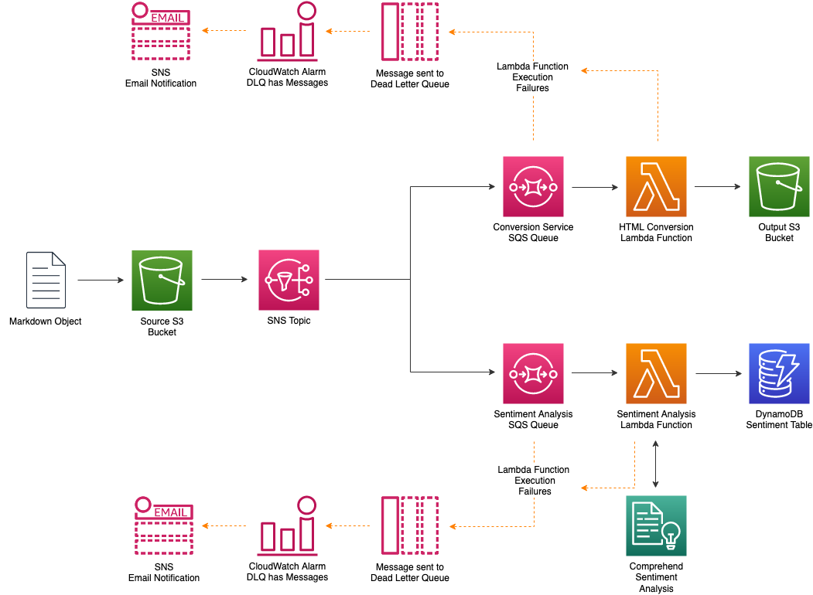

# Serverless Reference Architecture: Real-time File Processing

The Real-time File Processing reference architecture is a general-purpose, event-driven, parallel data processing architecture that uses [AWS Lambda](https://aws.amazon.com/lambda). This architecture is ideal for workloads that need more than one data derivative of an object. 

In this example application we deliver the notes from an interview in Markdown format to S3.  CloudWatch Events is used to trigger multiple processing flows - one to convert and persist Markdown files to HTML and another to detect and persist sentiment.

## Architectural Diagram



## Application Components

### Event Trigger

Unlike batch processing, in this architecture we process each individual file as it arrives. To achive this we utilize [AWS S3 Events](https://docs.aws.amazon.com/AmazonS3/latest/dev/NotificationHowTo.html) and [Amazon Simple Notification Service](https://docs.aws.amazon.com/sns/latest/dg/welcome.html). When an object is created in S3, an event is emitted to a SNS topic. We deliver our event to 2 seperate [SQS Queues](https://aws.amazon.com/sqs/), representing 2 different workflows. Refer to [What is Amazon Simple Notification Service?](https://docs.aws.amazon.com/sns/latest/dg/welcome.html) for more information about eligible targets.

### Conversion Workflow

We target a SQS queue for this workflow. Sending the JSON event to SQS first rather than directly to Lambda allows for more control of Lambda invocations and better error handling.

The Lambda service polls our queue on our behalf. When messages are available they will be delivered to our function. Lambda can automatically scale with the number of messages on the queue. Refer to [Using AWS Lambda with Amazon SQS](https://docs.aws.amazon.com/lambda/latest/dg/with-sqs.html) for more details.

If our Conversion Lambda function fails to process the messages, the function sends the event to a dead-letter queue (DLQ) for inspection. A CloudWatch Alarm is configured to send notification to an email address when there are any messages in the Conversion DLQ.

Our function business logic uses this information to retrieve the file from S3 using the [Python AWS SDK (boto3)](https://boto3.amazonaws.com/v1/documentation/api/latest/index.html?id=docs_gateway) and store it in a temporary location within the function execution environment. The path of the file is then passed to a python function which reads the file contents and converts it to HTML using the Python [Markdown Library](https://pypi.org/project/Markdown/). We then generate the filename for the new HTML file and write it to our temporary location. Finally we upload the new HTML file to an output S3 bucket.  If our function execution results in an error, we will 


### Sentiment Analysis Workflow

We are using AWS' AI/ML service [Amazon Comprehend](https://aws.amazon.com/comprehend/) which is a machine learning powered service that makes it easy to find insights and relationships in text. We use the Sentiment Analysis API to understand whether interview responses are positive or negative.

The Sentiment workflow uses the same SQS-to-Lambda Function pattern as the Coversion workflow. Our function downloads the markdown file, extracts the contents, and sends it to the Comprehend Sentiment Analysis API. This returns a Sentiment and a confidence score which describes the level of confidence that Amazon Comprehend has in the accuracy of its detection of sentiments.

Once we have our sentiment we persist the result to our [DynamoDB](https://aws.amazon.com/dynamodb/) table.

If our Sentiment Lambda function fails to process the messages, the function sends the event to a dead-letter queue (DLQ) for inspection. A CloudWatch Alarm is configured to send notification to an email address when there are any messages in the Sentiment DLQ.


## Deploying the Application

The application is built, packaged, and deployed using the [AWS SAM CLI](https://github.com/awslabs/aws-sam-cli).  

You can use the provided [AWS SAM template](./template.yml) to launch a stack that demonstrates the Lambda file processing reference architecture. Details about the resources created by this template are provided in the *SAM Template Resources* section of this document.

The sample can be built and deployed by running the script `deploy.sh`.

```bash
bash deploy.sh s3_bucketname aws_region email_address_to_receive_alarm_messages

# eg bash deploy.sh my_s3_bucket us-east-1 user@mydomain.com
```

**Note**

The S3 bucket *s3_bucketname* must exist prior to running the *deploy.sh* script.  This bucket is used  the sam package command to store the deployment package. If you need to create a bucket for this purpose, run the following command to create an Amazon S3 bucket: 

```bash
aws s3 mb s3://bucketname --region region  # Example regions: us-east-1, ap-east-1, eu-central-1, sa-east-1
```

### What Is Happening in the Script?

The *sam build* command builds your application dependencies and copies the source code to folders under *.aws-sam/build* to be zipped and uploaded to Lambda. 

```bash
sam build --use-container
```

The *sam package* command takes your Lambda handler source code and any third-party dependencies, zips everything, and uploads the zip file to your Amazon S3 bucket. That bucket and file location are then noted in the packaged-template.yaml file. The generated packaged-template.yaml file is used to deploy the application. 

```bash
sam package \
    --output-template-file packaged-template.yml \
    --s3-bucket bucketname
```

The *sam deploy* command deploys your application to the AWS Cloud.

```bash
sam deploy \
    --template-file packaged-template.yml \
    --stack-name lambda-file-refarch \
    --region region \
    --tags Project=lambda-file-refarch \
    --parameter-overrides AlarmRecipientEmailAddress=<your email address> \
    --capabilities CAPABILITY_IAM
```

You will receive an email asking you to confirm subscription to the `lambda-file-refarch-AlarmTopic` SNS topic that will receive alerts should either the `ConversionDlq` SQS queue or `SentimentDlq` SQS queue receive messages.

## Testing the Example

After you have created the stack using the CloudFormation template, you can test the system by uploading a Markdown file to the InputBucket that was created in the stack. You can use the *sample-1.md* and *sample-2.md* files in the repository as example files. After the files have been uploaded, you can see the resulting HTML file in the output bucket of your stack and collect the sentiment of each document. The CloudWatch logs for each of the functions will contain details of their execution.

You can use the following commands to copy a sample file from the provided S3 bucket into the input bucket of your stack.

```bash
INPUT_BUCKET=$(aws cloudformation describe-stack-resource --stack-name lambda-file-refarch --logical-resource-id InputBucket --query "StackResourceDetail.PhysicalResourceId" --output text)
aws s3 cp ./sample-1.md s3://${INPUT_BUCKET}/sample-1.md
aws s3 cp ./sample-2.md s3://${INPUT_BUCKET}/sample-2.md
```

Once the input files has been uploaded to the input bucket, a series of events are put into motion.

1. The input Markdown files are converted and stored in a separate S3 bucket.
```
OUTPUT_BUCKET=$(aws cloudformation describe-stack-resource --stack-name lambda-file-refarch --logical-resource-id ConversionTargetBucket --query "StackResourceDetail.PhysicalResourceId" --output text)
aws s3 ls s3://${OUTPUT_BUCKET}
```

2. The input Markdown files are analyzed and their sentiment published to a DynamoDB table.
```
DYNAMO_TABLE=$(aws cloudformation describe-stack-resource --stack-name lambda-file-refarch --logical-resource-id SentimentTable --query "StackResourceDetail.PhysicalResourceId" --output text)
aws dynamodb scan --table-name ${DYNAMO_TABLE} --query "Items[*]"
```

You can also view the CloudWatch logs generated by the Lambda functions.

## Cleaning Up the Example Resources

To remove all resources created by this example, run the following command:

```bash
bash cleanup.sh
```

### What Is Happening in the Script?

Objects are cleared out from the `InputBucket` and `ConversionTargetBucket`.

```bash
for bucket in InputBucket ConversionTargetBucket; do
  echo "Clearing out ${bucket}..."
  BUCKET=$(aws cloudformation describe-stack-resource --stack-name lambda-file-refarch --logical-resource-id ${bucket} --query "StackResourceDetail.PhysicalResourceId" --output text)
  aws s3 rm s3://${BUCKET} --recursive
  echo
done
```

The CloudFormation stack is deleted.

```bash
aws cloudformation delete-stack \
--stack-name lambda-file-refarch
```

The CloudWatch Logs Groups associated with the Lambda functions are deleted.

```bash
for log_group in $(aws logs describe-log-groups --log-group-name-prefix '/aws/lambda/lambda-file-refarch-' --query "logGroups[*].logGroupName" --output text); do
  echo "Removing log group ${log_group}..."
  aws logs delete-log-group --log-group-name ${log_group}
  echo
done
```

## SAM Template Resources

### Resources
[The provided template](https://s3.amazonaws.com/awslambda-reference-architectures/file-processing/packaged-template.yml)
creates the following resources:

- **InputBucket** - An S3 bucket that holds the raw Markdown files. Uploading a file to this bucket will trigger processing functions.

- **NotificationTopic** - A SNS topic that receives S3 events from the **InputBucket**.

- **NotificationTopicPolicy** - A SNS topic policy that allows the **InputBucket** to publish events to the **NotificationTopic**.

- **NotificationQueuePolicy** - A SQS queue policy that allows the **NotificationTopic** to publish events to the **ConversionQueue** and **SentimentQueue**.

- **ApplyS3NotificationLambdaFunction** - A Lambda function that adds a S3 bucket notification when objects are created in the **InputBucket**.  The function is called by **ApplyInputBucketTrigger**.

- **ApplyInputBucketTrigger** - A CloudFormation Custom Resource that invokes the **ApplyS3NotificationLambdaFunction** when a CloudFormation stack is created.

- **ConversionSubscription** - A SNS subscription that allows the **ConversionQueue** to receive messages from **NotificationTopic**.

- **ConversionQueue** - A SQS queue that is used to store events for conversion from Markdown to HTML.

- **ConversionDlq** - A SQS queue that is used to capture messages that cannot be processed by the **ConversionFunction**.  The *RedrivePolicy* on the **ConversionQueue** is used to manage how traffic makes it to this queue.

- **ConversionFunction** - A Lambda function that takes the input file, converts it to HTML, and stores the resulting file to **ConversionTargetBucket**.  Errors in the function will be sent to the **ConversionDlq**.

- **ConversionTargetBucket** - A S3 bucket that stores the converted HTML.

- **SentimentSubscription** - A SNS subscription that allows the **SentimentQueue** to receive messages from **NotificationTopic**.

- **SentimentQueue** - A SQS queue that is used to store events for sentiment analysis processing.

- **SentimentDlq** - A SQS queue that is used to capture messages that cannot be processed by the **SentimentFunction**.  The *RedrivePolicy* on the **SentimentQueue** is used to manage how traffic makes it to this queue.

- **SentimentFunction** - A Lambda function that takes the input file, performs sentiment analysis, and stores the output to the **SentimentTable**.  Errors in the function will be sent to the **SentimentDlq**.

- **SentimentTable** - A DynamoDB table that stores the input file along with the sentiment.

- **AlarmTopic** - A SNS topic that has an email as a subscriber.  This topic is used to receive alarms from the **ConversionDlqAlarm** and **SentimentDlqAlarm**.

- **ConversionDlqAlarm** - A CloudWatch Alarm that detects when there there are any messages sent to the **ConvesionDlq** within a 1 minute period and sends a notification to the **AlarmTopic**.

- **SentimentDlqAlarm** - A CloudWatch Alarm that detects when there there are any messages sent to the **SentimentDlq** within a 1 minute period and sends a notification to the **AlarmTopic**.

- **ConversionQueueAlarm** - A CloudWatch Alarm that detects when there are 20 or more messages in the **ConversionQueue** within a 1 minute period and sends a notification to the **AlarmTopic**.

- **SentimentQueueAlarm** - A CloudWatch Alarm that detects when there are 20 or more messages in the **SentimentQueue** within a 1 minute period and sends a notification to the **AlarmTopic**.

- **ConversionFunctionErrorRateAlarm** - A CloudWatch Alarm that detects when there is an error rate of 5% over a 5 minute period for the **ConversionFunction** and sends a notification to the **AlarmTopic**.

- **SentimentFunctionErrorRateAlarm** - A CloudWatch Alarm that detects when there is an error rate of 5% over a 5 minute period for the **SentimentFunction** and sends a notification to the **AlarmTopic**.

- **ConversionFunctionThrottleRateAlarm** - A CloudWatch Alarm that detects when ther is a throttle rate of 1% over a 5 minute period for the **ConversionFunction** and sends a notification to the **AlarmTopic**.

- **SentimentFunctionThrottleRateAlarm** - A CloudWatch Alarm that detects when ther is a throttle rate of 1% over a 5 minute period for the **SentimentFunction** and sends a notification to the **AlarmTopic**.

- **ApplicationDashboard** - A CloudWatch Dashboard that displays Conversion Function Invocations, Conversion Function Error Rate, Conversion Function Throttle Rate, Conversion DLQ Length, Sentiment Function Invocations, Sentiment Function Error Rate, Sentiment Function Throttle Rate, and Sentiment DLQ Length.

## License

This reference architecture sample is licensed under Apache 2.0.
